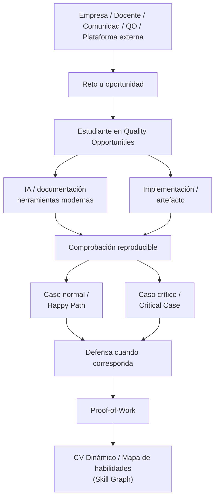

# Quality Opportunities

> ## **¿Cómo demuestra un estudiante lo que realmente sabe hacer si nadie le da la oportunidad de demostrarlo?**
>
> **Quality Opportunities convierte retos reales, simulados y abiertos en evidencia verificable de capacidad. Aprender deja de ser solo acumular cursos: se convierte en experiencia que puedes mostrar, explicar y defender.**

> **HUB de retos y oportunidades de aprendizaje aplicado** que convierte lo que un estudiante resuelve en **evidencia verificable de lo que realmente puede hacer**.

**Quality Opportunities centraliza oportunidades dispersas, permite resolverlas bajo criterios claros y transforma cada resultado relevante en Proof-of-Work navegable para el CV.** Nace desde software porque allí el desempeño puede comprobarse con pruebas y métricas técnicas, pero el modelo está pensado para extenderse a otras disciplinas donde exista un problema, un artefacto observable y una forma defendible de evaluarlo.

```text
OPORTUNIDADES DISPERSAS
Hackathons · Retos educativos · Empresas · Open Issues · Concursos
                              |
                              v
                  QUALITY OPPORTUNITIES
                              |
                              v
                  Resolver + Evaluar + Defender
                              |
                              v
                        PROOF-OF-WORK
                              |
                              v
                CV DINÁMICO / SKILL GRAPH
```

> **La idea central:** no queremos que el estudiante diga “sé hacerlo”; queremos que pueda **mostrar qué resolvió, cómo fue evaluado y por qué su solución merece confianza**.

---

## 1. Problematica y Enfoque Lean MVP

### Problematica

Muchos estudiantes aprenden, pero no tienen evidencia verificable de lo que saben hacer. Sus proyectos quedan aislados y, al llegar al mercado, enfrentan el **“CV en blanco”**. Aunque existen hackathons, retos y concursos, estas oportunidades están dispersas y rara vez se convierten en experiencia profesional demostrable.

### Usuario Objetivo

El usuario principal inicial es el **estudiante universitario de 5.º a 9.º ciclo** de Ingeniería de Sistemas, Software, Computación y carreras afines, con formación teórica pero poca experiencia verificable frente a problemas cercanos a contextos profesionales.

Como actores del ecosistema participan:

- **Empresas**, que pueden publicar, adaptar, patrocinar o enlazar retos y observar talento resolviendo contextos relevantes antes de una entrevista.
- **Universidades**, que pueden utilizar retos y artefactos como evidencia de aprendizaje aplicado.
- **Comunidades, docentes y profesionales senior**, que pueden curar desafíos a partir de experiencia de mercado, casos documentados y necesidades recurrentes de la industria.

### Propuesta de Valor y Alcance Lean MVP

Quality Opportunities funciona como un **HUB de oportunidades de resolución**. El estudiante encuentra un reto, lo resuelve con las herramientas modernas que considere necesarias, su trabajo se somete a criterios definidos por el challenge y el resultado puede convertirse en una página de **Proof-of-Work**.

Esa página no es una simple medalla: puede mostrar **qué problema resolvió, qué entregó, qué pruebas superó, qué métricas obtuvo, qué decisiones defendió y qué organización estuvo asociada al reto**.

Así, el valor para cada actor se entiende en una línea:

| Actor | Valor principal |
| :--- | :--- |
| **Estudiante** | Convierte práctica en evidencia profesional navegable y acumulativa. |
| **Empresa** | Transforma problemas u oportunidades en una forma de observar capacidad aplicada y fortalecer employer branding. |
| **Universidad / Comunidad** | Convierte aprendizaje aplicado en artefactos y resultados más fáciles de observar y documentar. |

### Tres modalidades iniciales de retos

No son categorías rígidas; representan tres maneras de alimentar el HUB sin depender de una única fuente.

#### 1. Reto Educativo Curado

Problema construido a partir de **investigación del mercado, casos públicos, postmortems, documentación técnica, proyectos open source y entrevistas o validación con profesionales senior** que conocen las necesidades de la industria.

Puede ser simulado, pero debe conservar restricciones, decisiones y criterios que desarrollen una capacidad relevante.

#### 2. Reto Empresarial Sanitizado

Desafío basado en una problemática real de una organización, **adaptado para poder resolverse sin exponer información sensible** mediante datos sintéticos o anonimizados, repositorios aislados y eliminación de detalles internos innecesarios.

**Sanitizar no significa borrar la identidad de la empresa.** Cuando la organización lo autorice, su marca puede permanecer visible mientras datos, arquitectura interna, código propietario y demás información confidencial permanecen protegidos.

#### 3. Open Issue u Oportunidad Abierta

Problema, hackathon, datathon, concurso o challenge que una organización decide publicar abiertamente. Quality Opportunities puede alojarlo directamente o funcionar como **capa de descubrimiento**, enviando al estudiante a la plataforma oficial cuando el reto ya existe fuera de QO.

Esto permite que una empresa participe sin reconstruir una convocatoria que ya posee y abre modelos de promoción, partnership e integración.

### Flujo principal

1. **Descubrir:** el estudiante encuentra una oportunidad según área, dificultad, habilidades y modalidad.
2. **Resolver:** utiliza IA, documentación, librerías y herramientas modernas.
3. **Evaluar:** QO comprueba la solución con criterios definidos por el reto; en software pueden incluir correctitud, rendimiento, resiliencia o consistencia.
4. **Defender:** cuando corresponde, el estudiante explica decisiones o responde ante un cambio de condición.
5. **Evidenciar:** QO registra el resultado como Proof-of-Work enlazable desde su perfil.

### Ejemplos de Retos

- **Idempotencia y Race Conditions en Pasarela de Pagos:** evitar cobros duplicados bajo concurrencia.
- **Mitigación de Picos de Tráfico y Rate Limiting:** controlar ráfagas de tráfico sin saturar servicios.
- **Pipeline ETL Asíncrono y Sanitización de Datos:** limpiar grandes volúmenes de datos de forma segura.
- **Diagnóstico y Refactor de Memory Leak Generado por IA:** detectar y corregir fugas de memoria.

---

## 2. Arquitectura Conceptual



---

## 3. Stack Tecnologico e Inteligencia Artificial

| Capa | Tecnologia / Servicio | Justificacion Tecnica |
| :--- | :--- | :--- |
| **Frontend** | React / Next.js / Tailwind CSS | Interfaz web moderna, responsive y orientada a una experiencia interactiva. |
| **Editor Web** | Monaco Editor | Edición y visualización de código y diffs directamente en navegador. |
| **Backend** | Python + FastAPI | APIs asíncronas, ejecución de pruebas, webhooks y servicios de evaluación. |
| **Validacion** | Pydantic | Contratos estrictos y validación estructurada de entradas y resultados. |
| **Base de Datos** | PostgreSQL | Persistencia relacional de usuarios, retos, intentos, resultados y evidencia. |
| **Caching / Colas** | Redis | Soporte para benchmarking, colas y escenarios de optimización. |
| **Sandbox** | Docker | Aislamiento efímero de ejecuciones y límites de CPU/memoria. |
| **CI/CD** | Pipeline automatizado | Ejecución reproducible de tests, benchmarks y validaciones por entrega. |
| **IA** | Tutor IA Socrático + asistencia contextual | Apoyo al aprendizaje, razonamiento y comprensión del trabajo realizado. |
| **Integridad** | SHA-256 | Vinculación de evidencia con entregas y resultados verificables. |

### IA como herramienta de aprendizaje

Quality Opportunities **no penaliza el uso de Inteligencia Artificial**. La plataforma parte de que los futuros profesionales trabajarán junto a herramientas de IA y que saber utilizarlas correctamente también es una competencia.

La evaluación se desplaza desde:

> “¿Lo hizo completamente solo?”

hacia:

> “¿Entiende lo que construyó? ¿Puede modificarlo, detectar errores y defender sus decisiones?”

El objetivo no es formar estudiantes que compitan contra la IA, sino estudiantes capaces de **trabajar con IA sin delegar su comprensión**.

### Tutor IA Socrático y Defensa Técnica

El Tutor IA puede guiar mediante preguntas sobre arquitectura, algoritmos, trade-offs y decisiones de diseño. Algunos retos pueden activar una **defensa técnica adaptativa**, seleccionando decisiones o métricas de la entrega para comprobar que la solución fue asimilada.

### Aprendizaje Vicario y Diff

Al cierre de un reto, el estudiante puede comparar su implementación con una solución de referencia mediante un visor de diferencias, entendiendo decisiones técnicas y trade-offs alternativos.

---

## 4. Evaluacion Tecnica y Testing

QO busca **comprobar que una solución realmente funciona bajo criterios claros y repetibles**. En software, esta comprobación puede ejecutarse automáticamente en un entorno aislado —sandbox— y adaptarse a lo que cada reto necesita medir.

Puede validar:

- **Happy Path:** el flujo principal funciona correctamente.
- **Critical Case:** la solución resiste la condición de alto impacto que puede romper el sistema.
- **Stress / Performance:** comportamiento bajo carga cuando sea relevante.
- **Memory Stability:** consumo anómalo y degradación de rendimiento.
- **Idempotencia y Resiliencia:** consistencia frente a reintentos o fallos parciales.
- **Comprensión / Defensa:** capacidad de justificar las decisiones cuando el reto lo requiera.

### Criterios definidos por reto

Un challenge puede exigir decenas de pruebas automatizadas, límites concretos de latencia o concurrencia; otro puede valorar principalmente correctitud, consistencia o calidad de la defensa. **Las métricas concretas pertenecen al reto, no son promesas universales de la plataforma.**

Para la demo del MVP priorizamos dos señales que un jurado puede comprender inmediatamente:

- **Happy Path:** funciona cuando todo ocurre como se espera.
- **Critical Case:** sigue siendo correcto cuando aparece la condición que realmente puede romperlo.

---

## 5. Proof-of-Work: Evidencia, Insignia y CV Dinamico

El producto no termina cuando un reto aparece como “completado”. El resultado importante es una **evidencia profesional explorable**: el Proof-of-Work que respalda lo que el estudiante afirma saber hacer.

Cada Proof-of-Work puede incluir:

- identidad y modalidad del reto;
- organización asociada, cuando corresponda;
- commit, repositorio o artefacto evaluado;
- resultado de pruebas o criterios de evaluación;
- métricas relevantes del challenge;
- defensa o explicación técnica;
- feedback empresarial o institucional cuando exista;
- hash SHA-256 para comprobar integridad de la evidencia asociada.

La Insignia funciona como una representación resumida de esa evidencia, mientras que la **Proof-of-Work Page es la fuente verificable detrás de ella**.

Así, el CV puede pasar de:

> “Experiencia en backend.”

A:

> **Transaction Reliability Challenge · Gold** — solución, criterios superados, repositorio y defensa accesibles desde el perfil.

### Trust & Quality

QO no premia simplemente “hacer más”. El perfil prioriza **calidad, dificultad, diversidad y nivel de verificación** sobre volumen bruto.

Repetir retos casi idénticos aporta valor marginal decreciente; el CV destaca las mejores evidencias y determinados challenges pueden exigir defensa o validación adicional. La unidad de valor no es el reto completado, sino **la evidencia que ese reto añade a una competencia**.

---

## 6. Escalabilidad y Evolución del Ecosistema

El MVP valida una hipótesis concreta:

> **Reto + Evidencia + Evaluación + Defensa = aprendizaje verificable.**

Software es la **primera vertical de validación, no el límite de QO**. El mismo principio puede aplicarse gradualmente a otras familias siempre que sea posible definir un problema, producir un artefacto observable y evaluar o defender el resultado.

| Familia | Ejemplos de expansión |
| :--- | :--- |
| **Tecnología, Ingeniería y Ciencias Aplicadas** | Data/IA, ciberseguridad, mecatrónica, robótica, electrónica, ingeniería industrial y mecánica. |
| **Diseño y Disciplinas Creativas Aplicadas** | UX/UI, producto, arquitectura, comunicación visual y producción audiovisual. |
| **Negocios y Gestión** | Estrategia, finanzas, marketing, operaciones, supply chain y emprendimiento. |
| **Derecho, Políticas y Ciencias Sociales Aplicadas** | Casos jurídicos, compliance, políticas públicas, investigación y argumentación basada en evidencia. |

El mecanismo de evaluación cambia con la disciplina: software puede utilizar **pruebas automatizadas y métricas técnicas**; diseño, proceso y artefactos; negocios, análisis y métricas; Derecho, investigación, argumentación y defensa.

### Tres ejes de escalabilidad

- **Fuentes:** retos curados → empresariales sanitizados → Open Issues y oportunidades externas.
- **Evidencia:** código y métricas → artefactos multidisciplinarios → historial profesional de capacidades demostradas.
- **Instituciones:** estudiantes individuales → empresas, universidades, comunidades y plataformas asociadas.

---

**Créditos — SinergIA**  
[Manuel Aranda (Manu)](https://github.com/MizardB) · [Miguel](https://github.com/Miguel-Ghost) · [Brian](https://github.com/BrianJY-14) · [Alex](https://github.com/josealexandromartinezcox-stack)

*Quality Opportunities quiere convertir oportunidades dispersas en experiencias accesibles y el aprendizaje aplicado en evidencia, construyendo una identidad profesional basada en lo que una persona puede demostrar, explicar y defender.*

> **HUB → RETO → EVIDENCIA.**