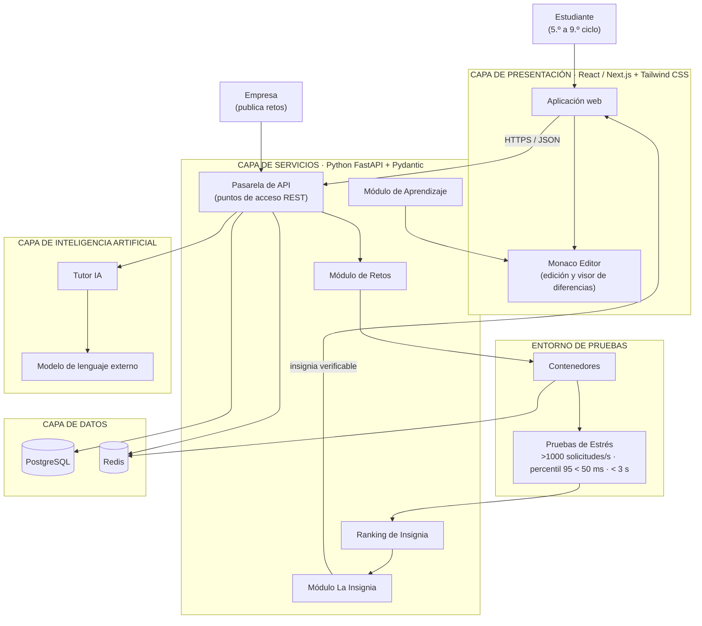
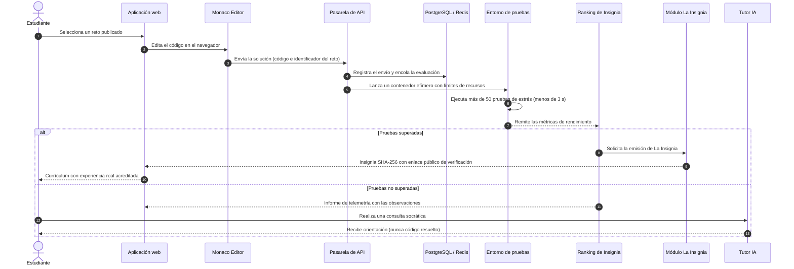
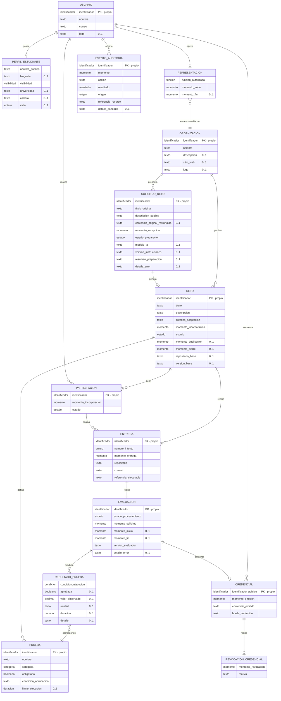
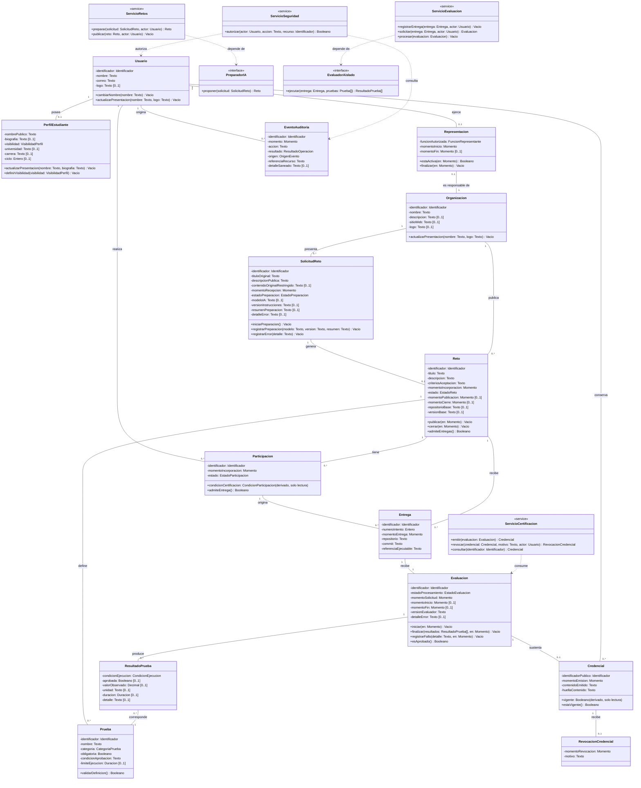

# Arquitectura del Sistema y Base de Datos — Quality Opportunities

> Ecosistema educativo basado en retos de producción (**retos de aprendizaje**) y **Prueba de Trabajo**. Este documento consolida la arquitectura técnica de la plataforma y el modelo de datos: estructura de módulos, diagramas de interacción, entidades, clases UML e integración con APIs e IA.

---

## 1. Resumen Ejecutivo

El presente documento describe la arquitectura técnica de la plataforma **Quality Opportunities**; un ecosistema educativo basado en retos de producción y prueba de trabajo, orientado a que los estudiantes universitarios acrediten experiencia real de ingeniería en su currículum. Se detalla la estructura de módulos, la comunicación entre la capa de presentación y la capa de servicios, el modelo de datos relacional y clases del backend, y la integración con inteligencia artificial y servicios externos.

---

## 2. Resumen de la Arquitectura

La plataforma sigue un esquema **por capas y módulos desacoplados**. Las empresas publican retos de optimización y deuda técnica; los estudiantes los resuelven en un **entorno de pruebas aislado** y cada entrega se somete a más de 50 pruebas automatizadas de rendimiento. Al validarse la solución, se emite **La Insignia**: una microcredencial inmutable con resumen criptográfico **SHA-256**, verificable públicamente e incrustable en el currículum del estudiante.

**Principios arquitectónicos:**

- Separación estricta de responsabilidades por capas.
- Comunicación **sin estado** mediante interfaces REST sobre HTTPS/JSON, con contratos validados de extremo a extremo.
- Evaluación **objetiva y reproducible** mediante contenedores efímeros con límites de procesador y memoria (grupos de control, *cgroups*).
- Inteligencia artificial **pedagógica**: orienta mediante el método socrático y **jamás genera código funcional** ni resuelve el reto por el estudiante.

---

## 3. Diagrama General del Sistema



---

## 4. Capas y Módulos

### 4.1 Capa de presentación — React / Next.js + Tailwind CSS

| Módulo | Responsabilidad |
|---|---|
| **Aplicación web** | Interfaz para estudiantes y empresas: catálogo de retos, currículum dinámico e informes de telemetría. |
| **Monaco Editor** | Edición de código en el navegador y **visor de diferencias** interactivo entre la implementación del estudiante y la solución óptima. |

### 4.2 Capa de servicios — Python (FastAPI) + Pydantic

| Módulo | Responsabilidad |
|---|---|
| **Pasarela de API** | Punto de entrada único; valida los contratos de datos y enruta las peticiones hacia los módulos correspondientes. |
| **Módulo de Retos** | Gestiona el ciclo de vida del reto: repositorio aislado, datos simulados y especificaciones de rendimiento. |
| **Ranking de Insignia** | Recibe las métricas del entorno de pruebas, valida los umbrales y calcula la clasificación. |
| **Módulo La Insignia** | Emite la credencial inmutable: resumen criptográfico SHA-256 de la confirmación de cambios más las métricas de ejecución. |
| **Módulo de Aprendizaje** | Aprendizaje vicario: sirve la comparación entre el código del estudiante y la solución óptima una vez cerrado el reto. |

### 4.3 Entorno de pruebas

| Módulo | Responsabilidad |
|---|---|
| **Contenedores** | Ejecución en contenedores efímeros con límites de procesador y memoria; aislamiento estricto respecto al servidor. |
| **Pruebas de Estrés** | Más de 50 pruebas automatizadas que evalúan concurrencia (**superior a 1000 solicitudes por segundo**), latencia (**percentil 95 inferior a 50 ms**) y estabilidad de memoria en **menos de 3 segundos**. |

### 4.4 Capa de inteligencia artificial

| Módulo | Responsabilidad |
|---|---|
| **Tutor IA** | Asistencia socrática: analiza el árbol de sintaxis abstracta del código y plantea preguntas orientadas a arquitectura y algoritmos. Directiva inquebrantable: nunca genera código. |
| **Modelo de lenguaje externo** | Servicio de modelos de lenguaje optimizado mediante **caché de indicaciones** para reducir costos de operación. |

### 4.5 Capa de datos

| Motor | Uso |
|---|---|
| **PostgreSQL** | Persistencia relacional: retos, envíos, insignias y usuarios. |
| **Redis** | Colas de evaluación de rendimiento y caché de telemetría. |

---

## 5. Comunicación entre Capas

La comunicación entre la capa de presentación y la capa de servicios es **asíncrona, sin estado y basada en REST sobre HTTPS/JSON**. Toda petición y respuesta se valida con contratos estrictos definidos mediante Pydantic.

**Puntos de acceso principales:**

```text
POST /api/retos                          Publicación de un reto (empresa)
POST /api/envios                         Envío de la solución (estudiante)
GET  /api/envios/{id}/telemetria         Informe de métricas de la ejecución
GET  /api/insignias/{resumen}            Verificación pública de La Insignia
GET  /api/retos/{id}/diferencias         Comparador de código (aprendizaje)
POST /api/tutor/consultas                Consulta socrática al Tutor IA
```

---

## 6. Proceso Integral de un Reto



---

## 7. Diagrama Entidad-Relación Conceptual

> **Alcance:** los tipos SQL, claves foráneas e índices quedan fuera de estos diagramas, por corresponder a la fase de implementación.

**14 entidades · 18 relaciones · Participación individual**



---

## 8. Clases UML del Backend

**14 clases de dominio + 4 servicios + 2 interfaces**



---

## 9. Integración con Inteligencia Artificial y Servicios Externos

| Servicio | Función dentro de la plataforma |
|---|---|
| **API de modelo de lenguaje** | Motor del Tutor IA; recibe el contexto construido a partir del árbol de sintaxis abstracta y devuelve orientación socrática. |
| **Vercel** | Alojamiento de la capa de presentación. |
| **Railway** | Alojamiento de la capa de servicios y de los trabajadores del entorno de pruebas. |
| **Supabase** | Instancia gestionada de PostgreSQL. |

---

## 10. Seguridad y Trazabilidad

- **Inmutabilidad de la credencial:** La Insignia se calcula como resumen criptográfico SHA-256 de la confirmación de cambios y de las métricas de ejecución; cualquier alteración invalida la verificación pública.
- **Aislamiento de ejecuciones:** Cada envío se evalúa en un contenedor efímero con límites de procesador y memoria; ningún código se ejecuta sobre el servidor.
- **Objetividad de la evaluación:** Se miden exclusivamente competencias técnicas verificables (algoritmos, latencia, concurrencia, perfilado de memoria y calidad del software).

---

## 11. Tecnologías Empleadas

| Capa | Tecnologías |
|---|---|
| **Presentación** | React / Next.js, Tailwind CSS, Monaco Editor |
| **Servicios** | Python, FastAPI (asincronía nativa), Pydantic |
| **Datos** | PostgreSQL, Redis |
| **Entorno de pruebas** | Contenedores Docker efímeros con grupos de control, integración y entrega continuas |
| **Inteligencia artificial** | Modelo de lenguaje externo con caché de indicaciones, análisis de árbol de sintaxis abstracta |
| **Infraestructura** | Vercel, Railway, Supabase |
