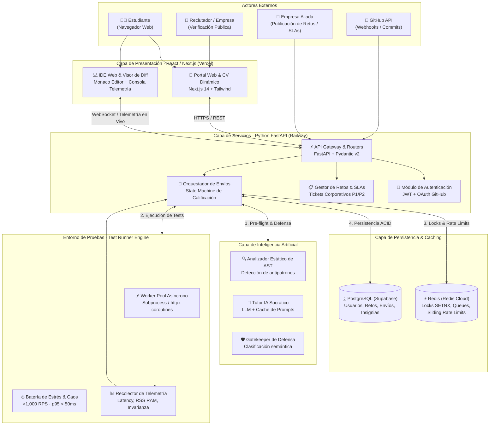
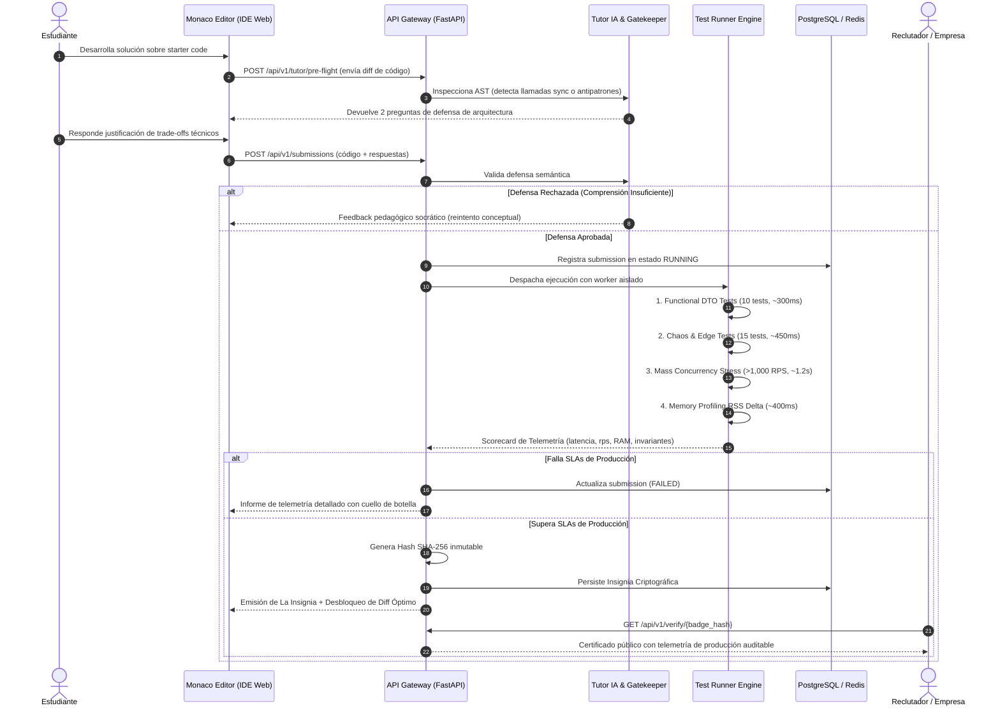
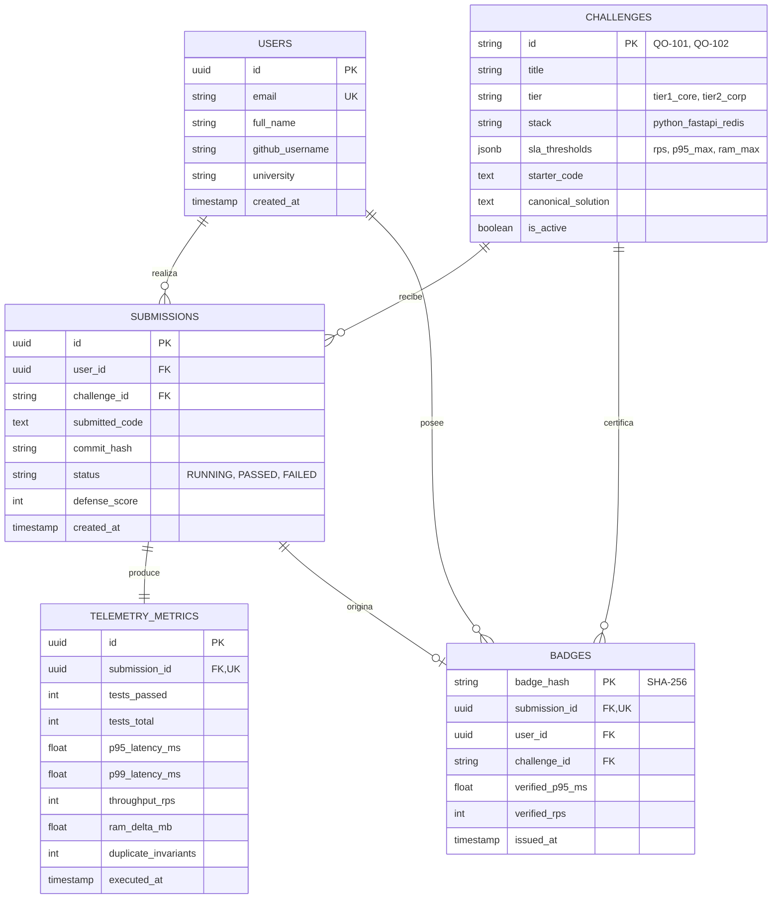

# Arquitectura de Software y Diseño de Sistema — Quality Opportunities

> **Proyecto:** Quality Opportunities  
> **Equipo:** SinergIA  
> **Track:** Future of Education — Software Week 2026 (UNI)  
> **Fase:** 1 (Arquitectura, Setup y Modelo Técnico)  
> **Versión:** 1.1.0  
> **Estado:** Consolidado y Aprobado  

---

## 1. Resumen Ejecutivo y Principios de Diseño

**Quality Opportunities** es un ecosistema educativo basado en retos de producción (**learning challenges**) y **Prueba de Trabajo Técnica (Proof-of-Work)**, diseñado para que estudiantes universitarios acrediten experiencia de ingeniería real directamente verificable por empresas contratantes.

### Principios Arquitectónicos Fundamentales
1. **Desacoplamiento Estricto por Capas (C2):** Separación nítida entre la capa de presentación (Next.js + Monaco Editor), la capa de orquestación de servicios (FastAPI), el motor de evaluación de alto rendimiento (Test Runner Engine) y los servicios de apoyo pedagógico (Tutor IA Socrático).
2. **Evaluación Determinista en Tiempo Polinomial (P vs. NP):** La síntesis de código de concurrencia es compleja (espacio NP), pero la verificación de invariantes bajo estrés y telemetría es determinista (tiempo P).
3. **Feedback en Tiempo Real (< 3 segundos):** Ejecución de más de 50 pruebas automatizadas (concurrencia > 1,000 req/s, latencia p95 < 50ms, memory leaks) sin sobrecarga de arranque en frío.
4. **Pedagogía Socrática con Cero Generación de Código:** El Tutor IA orienta al estudiante mediante el análisis de AST y preguntas de arquitectura, con la directiva inquebrantable de jamás proveer código funcional resuelto.
5. **Inmutabilidad Criptográfica:** Cada reto aprobado culmina en **La Insignia**, una credencial digital respaldada por un hash SHA-256 inmutable verificable públicamente con un clic.

---

## 2. Diagrama de Contenedores (Nivel C2)



---

## 3. Matriz de Componentes y Responsabilidades

| # | Contenedor / Módulo | Stack Tecnológico | Responsabilidad Primaria | SLA / Límite Operativo |
| :---: | :--- | :--- | :--- | :--- |
| **1** | **Frontend Web App** | React 18, Next.js 14, Tailwind CSS | Catálogo de retos, visualizador de credenciales, leaderboard y perfil de CV dinámico con telemetría auditada. | Carga inicial < 1.2s; 100% responsive. |
| **2** | **IDE Web & Diff Viewer** | Monaco Editor, WebSockets | Edición de código en el navegador con resaltado, consola de ejecución y visor de diferencias (aprendizaje vicario). | Latencia de socket < 25ms; autosave local. |
| **3** | **API Gateway (Backend)** | Python 3.11, FastAPI, Pydantic v2 | Punto de entrada unificado, autenticación, orquestación del ciclo de vida de envíos y emisión de hashes criptográficos. | Throughput > 1,500 req/s; p95 < 40ms. |
| **4** | **Test Runner Engine** | Python Asyncio, HTTPX, Memory Profiler | Ejecución en memoria de la suite de 50+ pruebas de estrés concurrentes (>1,000 req/s) e inyección de caos. | Suite completa ejecutada en < 3.0s. |
| **5** | **Tutor IA & Gatekeeper** | AST Python, LLM API (Gemini/OpenAI) | Detección estática de código bloqueante/alucinado, guía socrática interactiva y validación semántica de la defensa técnica. | Tiempo de respuesta socrática < 1.5s; 0 líneas de código resuelto. |
| **6** | **Base de Datos Relacional** | PostgreSQL 15 (Supabase Managed) | Persistencia ACID de usuarios, catálogo de retos sanitizados, historial de envíos e insignias emitidas. | RPO = 0; réplica administrada; pooling transaccional. |
| **7** | **Caché & Locking Distribuido**| Redis 7 (Redis Cloud / In-Memory) | Manejo de distributed locks (`SET NX PX`), almacenamiento de ventanas deslizantes para rate limiting y colas rápidas. | Latencia sub-milisegundo (< 2ms); TTL estricto. |

---

## 4. Proceso Integral de Ejecución y Ciclo de Vida (Diagrama de Secuencia)



---

## 5. Modelo de Datos y Persistencia Relacional

El esquema de base de datos en PostgreSQL garantiza integridad referencial estricta, trazabilidad de telemetría y verificación pública descentralizada:



---

## 6. Contratos de Integración (API Interfaces)

La API expone contratos estrictos serializados mediante **Pydantic v2**:

### 6.1. Envío de Solución y Calificación
- **Endpoint:** `POST /api/v1/submissions`
- **Request Payload:**
```json
{
  "challenge_id": "QO-101",
  "code": "async def checkout(payment: PaymentRequest, db = Depends(get_db)): ...",
  "defense_answers": [
    {
      "question_id": "q1_ttl",
      "selected_option": "B",
      "justification": "Se utiliza SETNX con TTL de 120s para evitar deadlocks en caso de caída del worker."
    }
  ]
}
```
- **Response Payload (Aprobado):**
```json
{
  "submission_id": "8f3b2a1c-99d4-4e2a-bb34-51e95b8340f1",
  "status": "PASSED",
  "scorecard": {
    "total_score": 96.5,
    "tests_passed": 50,
    "tests_total": 50,
    "throughput_rps": 1240,
    "p95_latency_ms": 34.2,
    "p99_latency_ms": 52.1,
    "ram_delta_mb": 2.1,
    "duplicate_records": 0
  },
  "badge": {
    "badge_hash": "e3b0c44298fc1c149afbf4c8996fb92427ae41e4649b934ca495991b7852b855",
    "verification_url": "https://qualityopps.dev/verify/e3b0c44298fc1c149afbf4c8996fb92427ae41e4649b934ca495991b7852b855"
  }
}
```

### 6.2. Verificación Pública de Insignia
- **Endpoint:** `GET /api/v1/verify/{badge_hash}`
- **Response Payload (Público, sin auth):**
```json
{
  "valid": true,
  "badge_hash": "e3b0c44298fc1c149afbf4c8996fb92427ae41e4649b934ca495991b7852b855",
  "student": {
    "full_name": "Manuel Aranda",
    "university": "Universidad Nacional de Ingeniería"
  },
  "challenge": {
    "id": "QO-101",
    "title": "Idempotencia y Race Conditions en Pasarela de Pagos",
    "partner": "Fintech Simulación BCP"
  },
  "audited_telemetry": {
    "p95_latency_ms": 34.2,
    "throughput_rps": 1240,
    "concurrency_level": "1,200 req concurrentes",
    "data_integrity": "100% (0 cobros duplicados)",
    "execution_timestamp": "2026-09-05T11:45:00Z"
  }
}
```

---

## 7. Deep Dive C3: Componentes de Alta Complejidad

### 7.1. Test Runner Engine (Oráculo de Estrés en < 3s)
Para lograr la meta no negociable de **50+ pruebas de estrés en menos de 3.0 segundos**, el motor no arranca contenedores pesados por cada petición. En su lugar opera con un **Worker Pool Asíncrono en Memoria**:
1. **Sandboxing de AST:** Antes de ejecutar, el módulo AST audita llamadas a sistema no autorizadas (`os.system`, `subprocess`, `eval`).
2. **Workers Pre-calentados:** Subprocesos Python aislados con límites de memoria fijados mediante `setrlimit` y cgroups.
3. **Inyector de Concurrencia HTTPX:** Dispara ráfagas asíncronas masivas mediante `asyncio.gather` simulando 1,200 peticiones en paralelo sobre el router en memoria.
4. **Verificador Formal de Invariantes:** Realiza un recuento ACID en PostgreSQL tras la ráfaga: si existen >= 1 registros duplicados con la misma clave de idempotencia, la suite desaprueba inmediatamente.

### 7.2. Tutor IA Socrático & Gatekeeper Semántico
1. **Parser de AST Dinámico:** Identifica en milisegundos si el estudiante introdujo llamadas síncronas bloqueantes (`time.sleep()`, `requests.get()`) en funciones `async def`.
2. **Motor Socrático Restrictivo:** El system prompt instruye al LLM a actuar exclusivamente como facilitador del método socrático. Tiene vetada la emisión de bloques de código de solución.
3. **Gatekeeper de Doble Pregunta:** Extrae los tokens modificados en el git diff y consulta contra una matriz de trade-offs pre-clasificada, evaluando la respuesta del alumno antes de conceder acceso a la suite de tests.

---

## 8. Registros de Decisiones de Arquitectura (ADRs)

### ADR-001: Worker Pool Asíncrono en Memoria vs. Contenedores Docker en Frío
* **Estado:** Aprobado
* **Contexto:** Las bases del evento y la usabilidad del IDE exigen devolver resultados de telemetría de estrés en menos de 3 segundos. El comando `docker run` en frío añade entre 1.5s y 3.5s de sobrecarga únicamente en iniciar el daemon y montar volúmenes, haciendo inviable el SLA.
* **Decisión:** Implementar un **Worker Pool Asíncrono pre-calentado** con aislamiento a nivel de AST y límites de recursos de Linux (`setrlimit`/`cgroups`) para el MVP.
* **Consecuencias:** Feedback instantáneo (< 2.8s total), cero latencia de arranque, alta densidad de pruebas simultáneas por servidor.

---

### ADR-002: Bloqueo Atómico Distribuido en Redis (`SET NX PX`) vs. `SELECT FOR UPDATE` en PostgreSQL
* **Estado:** Aprobado
* **Contexto:** En escenarios de ráfaga (CyberDay / Flash Sales con 15,000 req/s), aplicar bloqueos a nivel de fila en PostgreSQL satura el Connection Pool y degrada los servicios downstream provocando cascadas de errores HTTP 500.
* **Decisión:** Exigir como estándar de producción el uso de **Distributed Locks en Redis** mediante primitivas atómicas de una sola instrucción (`SET lock_key client_id NX PX 120000`). PostgreSQL se reserva para persistencia ACID con degradación optimista de fallback.
* **Consecuencias:** Latencia de verificación de lock < 2ms; alivio del 90% de conexiones simultáneas a la base de datos relacional.

---

### ADR-003: Oráculo de Verificación Híbrido P vs. NP (Telemetría Empírica + IA Socrática)
* **Estado:** Aprobado
* **Contexto:** Las plataformas tradicionales delegan la evaluación en la inspección manual de código por ingenieros Senior ($100 USD/h), o en verificadores de sintaxis que no garantizan comportamiento bajo estrés. Un LLM tampoco puede actuar como único juez, ya que es probabilístico.
* **Decisión:** Implementar un **Oráculo Híbrido**: la verificación de estrés y latencia se resuelve de forma determinista empírica (Tiempo P), mientras que la asimilación conceptual se valida mediante el Tutor IA Socrático actuando como Gatekeeper.
* **Consecuencias:** Cero horas requeridas de ingenieros Senior para calificar; eliminación del fraude por copypaste de ChatGPT; emisión de credenciales 100% auditables.

---

## 9. Despliegue e Infraestructura Cloud

| Componente | Plataforma de Hosting | Configuración / Tier | Propósito |
| :--- | :--- | :--- | :--- |
| **Frontend & IDE** | **Vercel** | Edge Network / Node.js 18 | Despliegue global de Next.js y assets estáticos de Monaco. |
| **API & Test Runner** | **Railway** | Contenedor Linux (2 vCPU, 4GB RAM) | Ejecución de FastAPI y orquestador asíncrono de pruebas. |
| **Base de Datos** | **Supabase** | PostgreSQL 15 Administrado | Persistencia con pooling transaccional y backups automáticos. |
| **Cache & Locks** | **Redis Cloud** | Instancia en memoria dedicada | Almacenamiento volátil ultra-rápido (< 2ms de latencia). |
| **Modelos de IA** | **Google Gemini / OpenAI API**| SDK Asíncrono con caching | Inferencia socrática de bajo costo y baja latencia. |
