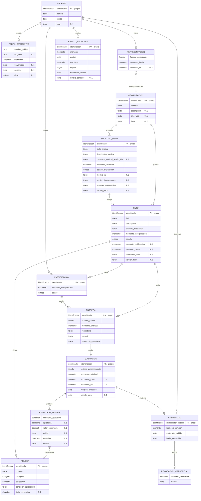
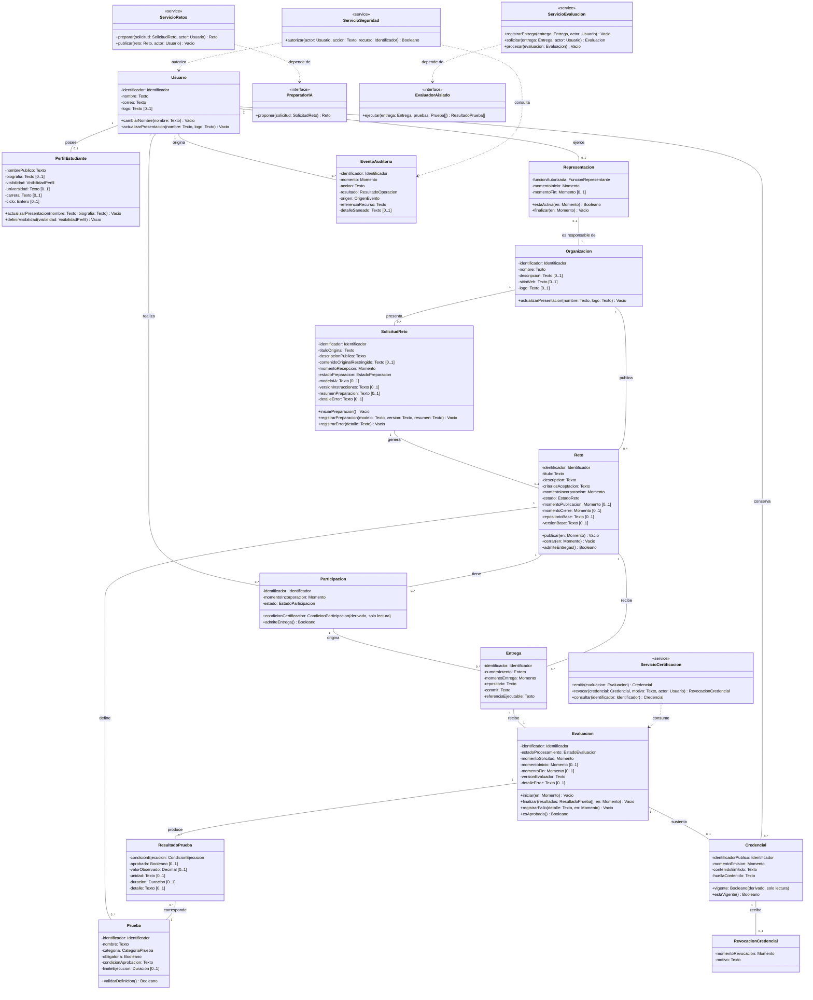

# Arquitectura de Base de Datos

Modelo de datos. Este documento contiene los
diagramas conceptuales del proyecto: el esquema entidad-relación y el
diagrama de clases del backend.

> **Alcance:** los tipos SQL, claves foráneas e índices quedan fuera de estos
> diagramas, por corresponder a la fase de implementación.

---

## 1. Diagrama Entidad-Relación Conceptual

**14 entidades · 18 relaciones · Participación individual**

---

## 2. Clases UML del Backend

**14 clases de dominio + 4 servicios + 2 interfaces**

