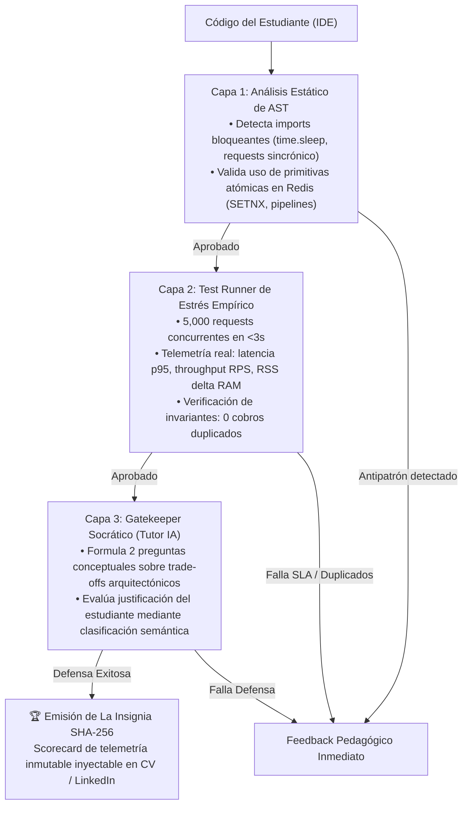

# 🚀 Retos de Plataforma, Enunciados, Evaluación y Tutor IA

> **Propósito:** Especificación canónica de los retos de ingeniería que vivirán en la plataforma **Quality Opportunities**, sus enunciados en formato ticket corporativo, los criterios rigurosos de evaluación en el Test Runner integrado en el IDE y el protocolo operativo del **Tutor IA Socrático** antes de que el estudiante envíe su solución final.

---

## 1. Catálogo de Problemas y Taxonomía de Retos

La plataforma categoriza sus desafíos mediante una taxonomía de 3 Tiers para garantizar disponibilidad inmediata (*cold start*) y escalabilidad con empresas aliadas:

```
                  ┌─────────────────────────────────────────┐
                  │    TIER 3: SPOTLIGHT / HUB EXTERNO      │
                  │  (Hackathons, Datathons, Concursos B2B) │
                  ├─────────────────────────────────────────┤
                  │     TIER 2: CORPORATIVO SANITIZADO      │
                  │  (Tickets P2/P3 Reales de Empresas B2B) │
                  ├─────────────────────────────────────────┤
                  │     TIER 1: CORE FORMATIVO (MVP)        │
                  │ (Canónicos in-house: Concurrencia, ETL) │
                  └─────────────────────────────────────────┘
```

### Matriz de Retos del MVP (Fase 1 y Fase 2)

| ID | Nombre del Reto | Stack Tecnológico | Problemática de Producción | SLA Crítico de Aprobación |
| :--- | :--- | :--- | :--- | :--- |
| **`QO-101`** | **Idempotencia y Race Conditions en Pasarela de Pagos** | Python (FastAPI) + Redis + PostgreSQL | Cobros duplicados por reintentos desordenados de red y race conditions bajo tráfico masivo. | 0 cobros duplicados en 5,000 requests concurrentes; p95 < 50ms. |
| **`QO-102`** | **Mitigación de Picos de Tráfico y Rate Limiting** | Python (FastAPI) + Redis (Token Bucket) | Saturación de microservicios downstream por ráfagas (*flash sales* / DDoS accidental). | Throughput > 1,200 req/s; 0 errores 500; 100% de requests excedentes limitadas a HTTP 429. |
| **`QO-103`** | **Pipeline ETL Asíncrono y Sanitización de Datos** | Python + Pydantic v2 + SQLite/Postgres | Ingesta de millones de registros sucios que corrompen la base de datos y saturan la RAM. | Procesamiento de 50k registros en < 2.5s; RSS delta < 5MB; 0 fallos de schema. |
| **`QO-104`** *(Especial)* | **Diagnóstico y Refactor de Memory Leak Generado por IA** | Python + Asyncio + Memory Profiler | Un backend escrito con IA "alucina" referencias circulares globales y desborda memoria tras 1,000 peticiones. | Estabilidad de memoria plana (leak slope = 0); latencia constante. |

---

## 2. Fundamento Teórico y Operativo: La IA como Oráculo de Verificación (P vs. NP)

> **Tesis Central:** *En la era de la inteligencia artificial, generar código sintácticamente plausible es trivial, pero sintetizar una solución arquitectónicamente óptima bajo estrés de producción sigue siendo un problema complejo (NP). En cambio, **verificar si una solución cumple con los SLAs de latencia, concurrencia y atomicidad es un problema determinista verificable en tiempo polinomial (P)** mediante telemetría empírica y análisis de AST.*

### 2.1. La Asimetría Computacional: ¿Por qué la IA Evalúa pero no Puede "Fabricar" la Solución?

1. **La Dificultad de la Síntesis (NP-Hard en Sistemas Distribuidos):**
   - Cuando un estudiante o un LLM intenta resolver un cuello de botella de concurrencia (ej. cobros duplicados en pasarelas de pago), intervienen variables de estado distribuido no estructuradas: race conditions a nivel de microsegundos, contención en Redis, fallos parciales de red y trade-offs entre consistencia y disponibilidad.
   - **La debilidad del LLM como programador:** Un modelo generativo produce código probabilístico basado en tokens frecuentes. En sistemas concurrentes, el LLM suele alucinar que un bloque `try/except` o un `sleep()` resuelven una race condition, cuando en realidad bajo 1,000 req/s colapsan.
2. **La Eficiencia de la Verificación (P - Tiempo Polinomial y Determinista):**
   - Para saber si una solución es correcta, el sistema **no le pide a otro LLM que "opine" sobre el código**.
   - El sistema actúa como un **Verificador Formal (Oráculo Empírico)**: dispara 5,000 peticiones concurrentes en 2 segundos, monitorea el Event Loop de FastAPI y audita la base de datos relacional. Si hubo 1 cobro duplicado o la latencia p95 superó los 50ms, la solución es matemáticamente rechazada.
   - **Conclusión para el jurado:** *"No evaluamos conjeturas ni sintaxis; evaluamos el comportamiento dinámico del software en tiempo de ejecución. La verificación es objetiva, reproducible y determinista."*

---

### 2.2. Modelo Operativo B2B: Cero Costo de Horas Senior para la Empresa

Una debilidad letal de las plataformas tradicionales de reclutamiento o hackathons corporativas es exigir que los Tech Leads de la empresa revisen pull requests o evalúen proyectos manualmente:
- La hora de un ingeniero Senior / Tech Lead cuesta **$80 — $120 USD**.
- Sus backlogs ya están desbordados atendiendo incidentes críticos de producción.
- Pedirles que dediquen 20 horas a calificar código de estudiantes paraliza la adopción comercial.

#### La Solución de Quality Opportunities: El "Oráculo Autónomo"
- **La empresa aporta el síntoma, no el tiempo de revisión:** La compañía entrega el contrato OpenAPI y el SLA exigido (ej. *"este endpoint debe soportar 1,000 req/s con p95 < 40ms"*).
- **Evaluación 100% Autónoma:** El Test Runner Engine y el Tutor Socrático se encargan del 100% de la ejecución, estrés test, telemetría y emisión de la Insignia SHA-256.
- **Entregable para la Empresa:** Cero horas invertidas en corrección. El partner recibe directamente un **Leaderboard Auditado** de candidatos que ya demostraron con números que su código supera el SLA de producción.

---

### 2.3. Taxonomía de Retos por Tier: Cómo se Testea y Califica cada Nivel

| Nivel | Tipo de Reto | Origen del Problema | Mecánica de Testeo (Runner) | Mecánica de Calificación (IA & Telemetría) | Intervención Humana |
| :---: | :--- | :--- | :--- | :--- | :---: |
| **Tier 1** | **Core Formativo (In-house)** | Retos canónicos de concurrencia, idempotencia, rate limiting y memoria diseñados con Seniors/Fellows. | Test Runner integrado en vivo disparando baterías de 50+ pruebas de estrés (locust/httpx asíncronos en memoria). | **Scorecard de 3 Capas:**<br>1. AST check (sin trampa).<br>2. Telemetría empírica (RPS, p95, RAM).<br>3. Gatekeeper Socrático (IA valida defensa conceptual). | **0 horas** (100% autónomo) |
| **Tier 2** | **Corporativo Sanitizado (B2B)** | Tickets reales P2/P3 de optimización provistos por empresas aliadas (BCP, Interbank, Rimac, etc.). | Se ejecuta contra la suite de aceptación del contrato OpenAPI corporativo previamente sanitizado. | Si la solución del estudiante iguala o supera el SLA histórico de la empresa, el sistema genera la Insignia SHA-256 con el logo oficial de la marca. | **0 horas de revisión** (La empresa solo firma el SLA inicial) |
| **Tier 3** | **Spotlight Externo (Hub)** | Convocatorias a Hackathons, Datathons y Challenges externos organizados por empresas. | La prueba de la competencia vive en la infraestructura externa del partner organizador. | Quality Opportunities actúa como **filtro de pre-admisión**: solo los estudiantes con insignias Tier 1 certificadas acceden a fast-tracks o postulaciones destacadas. | **0 horas** (La empresa gestiona su evento propio) |

---

### 2.4. El Pipeline de Evaluación Autónoma en 3 Capas



---

## 3. Enunciados de los Retos (Tickets Corporativos)

Los enunciados no son problemas teóricos de manual universitario; se presentan como **Tickets de Ingeniería Reales** (formato Jira / Linear) con contexto de negocio, deuda técnica, starter code y Definición de Terminado (DoD).

---

### Reto 1 (`QO-101`): Idempotencia y Race Conditions en Pasarela de Pagos

```
╔══════════════════════════════════════════════════════════════════════════════════╗
║ TICKET: QO-101 | PRIORIDAD: P1 - CRÍTICO                                         ║
║ COMPONENTE: payment-gateway-service                                              ║
║ PATROCINADOR / CASO: Simulación Fintech BCP / Yape                               ║
╚══════════════════════════════════════════════════════════════════════════════════╝
```

#### Contexto del Incidente en Producción
> *"Durante las campañas de CyberDay, usuarios con conexiones intermitentes presionan repetidamente el botón 'Pagar con Yape'. Los reintentos automáticos del SDK móvil envían hasta 6 peticiones idénticas en una ventana de 150 milisegundos. Nuestro endpoint actual (`POST /api/v1/checkout`) verifica el saldo en PostgreSQL de forma síncrona sin control de concurrencia distribuida. Resultado: se han registrado cobros duplicados y triplicados en 340 cuentas de clientes en los últimos 30 días, provocando un impacto financiero de S/. 45,000 y reclamos ante INDECOPI."*

#### Código Base Recibido (Starter Code con Vulnerabilidad)
```python
# app/routers/checkout.py
from fastapi import APIRouter, HTTPException, Depends
from app.schemas import PaymentRequest, PaymentResponse
from app.database import get_db

router = APIRouter()

@router.post("/checkout", response_model=PaymentResponse)
async def process_payment(payment: PaymentRequest, db = Depends(get_db)):
    # VULNERABILIDAD CRÍTICA: Race Condition
    # Si llegan 2 requests con la misma idempotency_key en paralelo,
    # ambas leen que no existe registro previo antes de que alguna inserte.
    existing = await db.payments.find_one({"idempotency_key": payment.idempotency_key})
    if existing:
        return PaymentResponse(status="ALREADY_PROCESSED", transaction_id=existing.id)

    # Simulación de cargo bancario (50ms de latencia de red)
    charge = await db.external_bank_charge(payment.user_id, payment.amount)
    
    # Inserción tardía: la ventana de carrera ya ocurrió
    saved_tx = await db.payments.insert(payment.dict(), charge_id=charge.id)
    return PaymentResponse(status="SUCCESS", transaction_id=saved_tx.id)
```

#### Definición de Terminado (DoD)
1. **Verificación de Idempotencia en Redis:**
   - Extraer el header `X-Idempotency-Key`. Si no está presente, rechazar con HTTP `400 Bad Request`.
   - Implementar un mecanismo de bloqueo atómico distribuido en Redis (utilizando comandos atómicos como `SET key value NX PX <ttl>`) con un TTL de 120 segundos.
2. **Atomicidad Transaccional:**
   - Si una petición concurrente llega mientras la primera transacción está en tránsito, debe esperar o responder con estado `IN_PROGRESS` (HTTP 409 o replay según la convención corporativa), sin procesar jamás un segundo cobro al banco.
3. **Resiliencia ante Caída de Redis:**
   - Si Redis no responde (timeout > 200ms), activar un fallback degradado a bloqueo optimista en PostgreSQL (`SELECT ... FOR UPDATE` o constraint único).
4. **SLA de Producción:**
   - Soportar 1,000 req/s concurrentes.
   - Latencia percentil 95 (p95) < 50 ms.
   - Exactamente 0 cobros duplicados verificados en base de datos.

---

### Reto 2 (`QO-102`): Mitigación de Picos de Tráfico y Rate Limiting

```
╔══════════════════════════════════════════════════════════════════════════════════╗
║ TICKET: QO-102 | PRIORIDAD: P2 - ALTA                                            ║
║ COMPONENTE: api-gateway / traffic-control                                        ║
║ PATROCINADOR / CASO: Venta Flash de Entradas (Caso Teleticket / Joinnus)          ║
╚══════════════════════════════════════════════════════════════════════════════════╝
```

#### Contexto del Incidente en Producción
> *"Al abrir la venta de entradas para un concierto masivo, recibimos 15,000 req/s en el endpoint `POST /api/v1/tickets/reserve`. El microservicio downstream de reservas colapsó por saturación del pool de conexiones a la base de datos (HTTP 500 / 504 Gateway Timeout), afectando a usuarios legítimos y permitiendo que revendedores acaparen tickets."*

#### Definición de Terminado (DoD)
1. **Algoritmo de Rate Limiting por IP y Token de Usuario:**
   - Implementar el algoritmo **Sliding Window Log** o **Token Bucket** respaldado en Redis.
   - Límite asignado: máximo **10 peticiones por ventana de 5 segundos** por usuario/IP.
2. **Respuesta Estándar RFC 6585:**
   - Las peticiones que excedan el límite deben retornar de inmediato HTTP `429 Too Many Requests` con los headers:
     * `X-RateLimit-Limit: 10`
     * `X-RateLimit-Remaining: 0`
     * `Retry-After: <segundos_restantes>`
3. **Cero Sobrecarga de Latencia:**
   - La capa de filtrado no debe añadir más de **3 ms** de latencia a las peticiones válidas.
4. **SLA de Producción:**
   - Throughput evaluado: 1,500 req/s.
   - Cero excepciones no controladas (HTTP 500 = 0%).

---

### Reto 3 (`QO-103`): Pipeline ETL y Sanitización Masiva de Datos

```
╔══════════════════════════════════════════════════════════════════════════════════╗
║ TICKET: QO-103 | PRIORIDAD: P2 - ALTA                                            ║
║ COMPONENTE: onboarding-batch-importer                                            ║
║ PATROCINADOR / CASO: Ingesta Masiva de Clientes B2B (Caso Nubank / Niubiz)        ║
╚══════════════════════════════════════════════════════════════════════════════════╝
```

#### Contexto del Incidente en Producción
> *"Los archivos CSV de onboarding diario enviados por partners corporativos contienen hasta 500,000 filas con inconsistencias: números de DNI con caracteres no numéricos, campos de correo corruptos y registros duplicados. El script actual lee todo el archivo en memoria (`pandas.read_csv`), lo que provoca que el pod de Kubernetes sea terminado por OOM (Out Of Memory) al superar el límite de 512MB de RAM."*

#### Definición de Terminado (DoD)
1. **Procesamiento Asíncrono por Chunks:**
   - Modificar el pipeline para leer el stream en lotes (*chunks*) de 1,000 registros usando generadores o streams asíncronos sin cargar el dataset completo en memoria.
2. **Validación Estricta con Pydantic v2:**
   - DNI peruano: exactamente 8 dígitos numéricos válidos.
   - Teléfono: formato E.164 o 9 dígitos nacionales.
   - Sanitización de inyecciones XSS / caracteres invisibles en nombres y direcciones.
3. **Manejo de Errores Dead-Letter Queue (DLQ):**
   - Los registros inválidos no deben abortar el lote; deben segregarse automáticamente a un archivo/tabla de `ingestion_dead_letter` con el detalle del error de validación.
4. **SLA de Producción:**
   - Procesar 50,000 registros en menos de 2.5 segundos.
   - Consumo máximo de memoria RAM: incremento inferior a 15MB durante toda la ejecución.

---

## 4. Arquitectura del Test Runner Integrado en el IDE

El sistema de evaluación de **Quality Opportunities** opera mediante un **Test Runner asíncrono en memoria integrado directamente en el IDE Web**. Sin sobrecarga de orquestación de contenedores Docker pesados para el MVP, la suite completa se ejecuta en **menos de 3 segundos** mediante workers asíncronos (`httpx` / subprocesos aislados), arrojando telemetría auditable en tiempo real.

```
┌────────────────────────────────────────────────────────────────────────┐
│        TEST RUNNER ENGINE INTEGRADO EN EL IDE (<3 SEGUNDOS)            │
├────────────────────────────────────────────────────────────────────────┤
│ 1. Validación de Sintaxis & AST (Static Check)                 ~150ms  │
│ 2. Pruebas Funcionales DTO / Happy Path (10 tests)            ~300ms  │
│ 3. Pruebas de Borde & Chaos Injection (15 tests)              ~450ms  │
│ 4. Stress Testing Concurrente: 1,000+ RPS (25 tests)          ~1.2s   │
│ 5. Memory Profiling & Leak Detection                           ~400ms  │
│ 6. Cálculo de Scorecard & Hash SHA-256                         ~100ms  │
└────────────────────────────────────────────────────────────────────────┘
```

### Batería de Pruebas Automatizadas (50+ Tests)

1. **Capa Funcional (Tests 01 al 15):**
   - Validación de schemas JSON, tipos de datos, códigos de respuesta HTTP (`200`, `201`, `400`, `404`, `422`).
   - Verificación de persistencia correcta en base de datos.
2. **Capa de Borde y Caos (Tests 16 al 30):**
   - Inyección de headers ausentes, payloads vacíos, cadenas de 10,000 caracteres, desconexión forzada de Redis para validar fallback.
   - Peticiones repetidas con intervalos variables (1ms, 5ms, 50ms, 120s).
3. **Capa de Concurrencia y Estrés Masivo (Tests 31 al 50):**
   - Lanzamiento de **1,200 peticiones en paralelo** mediante corrutinas de `httpx` asíncronas distribuidas contra la misma entidad financiera o cupo de ticket.
   - **Verificación de Invarianza Transaccional:** Se audita la base de datos para confirmar que la suma de saldos coincide exactamente y que no existe ni un solo registro duplicado.

### Scorecard de Telemetría (Criterios de Aprobación SLA)

| Dimensión | Métrica Auditada | Umbral Exigido | Condición de Desaprobación |
| :--- | :--- | :--- | :--- |
| **Throughput** | Peticiones procesadas por segundo | `> 1,000 req/s` | `< 800 req/s` |
| **Latencia p95** | Percentil 95 de tiempo de respuesta | `< 50 ms` | `> 75 ms` |
| **Latencia p99** | Percentil 99 de tiempo de respuesta | `< 80 ms` | `> 120 ms` |
| **Consistencia** | Cobros duplicados / Race conditions | **0 fallos (0.00%)** | >= 1 duplicado |
| **Estabilidad de RAM** | Delta de consumo de memoria RSS | `< 5 MB` de incremento | Memory leak detectable |

### Generación Criptográfica de "La Insignia"

Cuando el runner aprueba la suite, el sistema calcula un hash **SHA-256** determinista e inmutable:

`Badge Hash = SHA256(StudentID + ChallengeID + CommitID + p95Latency + TestScore + Timestamp)`

Este hash se estampa en el **CV Dinámico Verificable** del estudiante con URL pública (`/verify/<hash>`), permitiendo a los reclutadores corporativos inspeccionar el scorecard de telemetría real.

---

## 5. Qué va a hacer el Tutor IA antes de Enviar la Solución

El **Tutor IA Socrático** es el diferenciador pedagógico central de Quality Opportunities. Su propósito no es fiscalizar ni castigar al estudiante por usar herramientas modernas (ChatGPT, Claude, Copilot están permitidos). Su misión es **asegurar que el estudiante entienda, asimile y pueda defender la solución que está entregando**.

```
                FLUJO DEL TUTOR IA ANTES DEL ENVÍO
                
   [ Estudiante escribe código en el IDE ]
                │
                ▼
   ┌──────────────────────────────────────────────┐
   │ 1. Análisis Estático de AST (Background)     │
   │    - Detecta antipatrones y código ciego     │
   └──────────────────────┬───────────────────────┘
                          │
                          ▼
   ┌──────────────────────────────────────────────┐
   │ 2. Asistencia Socrática Interactiva          │
   │    - Responde dudas con preguntas y pistas   │
   │    - REGLA: JAMÁS genera código ejecutable   │
   └──────────────────────┬───────────────────────┘
                          │
                          ▼  (Estudiante hace clic en "Enviar Solución")
   ┌──────────────────────────────────────────────┐
   │ 3. Pre-Flight Check de Salud Arquitectónica  │
   │    - Alerta si hay memory leaks o imports    │
   └──────────────────────┬───────────────────────┘
                          │
                          ▼
   ┌──────────────────────────────────────────────┐
   │ 4. GATEKEEPER SOCRÁTICO (Defensa Pre-Envío)  │
   │    - 2 preguntas adaptativas de arquitectura │
   │    - El estudiante justifica sus trade-offs  │
   └──────────────────────┬───────────────────────┘
                          │
                          ▼
             [ Solución validada y autorizada ]
             [ Ejecución en Test Runner del IDE ]
```

### Fase 1: Análisis de AST y Detección de Antipatrones (Tiempo Real)
El Tutor corre un parser de AST (Abstract Syntax Tree) en el backend sobre el código del editor web:
- **Detección de "Copypaste Ciego":** Detecta si el estudiante pegó bloques de código con funciones inexistentes, variables alucinadas o librerías que no forman parte del runtime autorizado.
- **Detección de Bloqueos en Concurrencia:** Si el estudiante utiliza librerías síncronas bloqueantes (ej. `time.sleep()`, `requests.get()` en un endpoint `async def`), el Tutor emite una alerta pedagógica en el panel lateral:
  > *"Observación: estás utilizando llamadas de red síncronas dentro de una corrutina async. ¿Qué impacto causará esto en el Event Loop de FastAPI cuando entren 1,000 peticiones concurrentes?"*

### Fase 2: Diálogo Socrático durante el Desarrollo (Regla de Cero Código)
El Tutor opera con un system prompt estricto que **prohíbe tajantemente escribir código resuelto**:
- **Si el estudiante pregunta:** *"¿Cómo implemento el lock en Redis para que no cobren doble?"*
- **El Tutor NO hace:** Escribir `redis.set(key, val, nx=True, ex=120)`.
- **El Tutor responde:**
  > *"Para evitar que dos peticiones simultáneas ejecuten la misma transacción, necesitas que la verificación de existencia y la asignación del bloqueo ocurran en una sola operación indivisible (atómica).  
  > 1. Investiga el comando `SET` de Redis con los parámetros `NX` y `PX`.  
  > 2. ¿Por qué es indispensable que el lock tenga un TTL de expiración en lugar de eliminarlo únicamente al final con `DEL`? ¿Qué pasaría si el contenedor muere a mitad de la operación?"*

### Fase 3: Pre-Flight Check (Revisión Preventiva antes de Quemar Intentos)
Cuando el estudiante presiona el botón **[🚀 Preparar Envío al Test Runner]**, el Tutor IA ejecuta un diagnóstico preventivo:
- **Verificación de Contrato:** Comprueba que las firmas de las funciones y los schemas DTO de respuesta no hayan sido modificados ni corrompidos.
- **Check de Recursos:** Verifica que los clientes de Redis o PostgreSQL cuenten con manejo adecuado de conexiones (ej. context managers `async with` para evitar *connection pool starvation*).
- Si detecta un fallo arquitectónico obvio, emite una advertencia de bajo impacto:
  > *"Aviso de Arquitectura: Notamos que la clave de Redis no incluye el prefijo del tenant ni maneja excepciones de desconexión. Tu solución podría fallar en la prueba de caos #18. ¿Deseas revisarla o prefieres lanzar la suite de todas formas?"*

### Fase 4: Gatekeeper Socrático (Mini-Defensa Adaptativa Pre-Envío)
Para evitar que un estudiante "fuerce por fuerza bruta" el runner o utilice código generado por una IA externa sin haberlo comprendido, el sistema activa un **Gatekeeper de Comprensión**:

1. **Generación Adaptativa:** El Tutor toma el diff del código escrito y formula **2 preguntas reflexivas sobre las decisiones técnicas tomadas**:
   - **Pregunta A (Trade-off de Rendimiento):**  
     > *"Optaste por un TTL de 120 segundos en la clave de idempotencia. Si la pasarela de pagos externa experimenta una degradación de red y responde a los 125 segundos, ¿qué ocurriría con una petición de reintento que ingrese en ese intervalo?"*  
     *(Opciones de selección múltiple con justificación o campo de respuesta técnica guiada).*
   - **Pregunta B (Diseño de Resiliencia):**  
     > *"En caso de que el nodo de Redis sufra una caída temporal, ¿por qué es preferible retornar un error controlado HTTP 503 con 'Retry-After' en lugar de degradar a una consulta síncrona sin lock a la base de datos relacional?"*
2. **Validación de Asimilación:**
   - La respuesta del estudiante se evalúa mediante un modelo ligero de clasificación semántica.
   - Si el estudiante demuestra comprensión conceptual, la solución se libera inmediatamente al Test Runner de estrés del IDE.
   - Si no logra justificar sus decisiones, el Tutor le ofrece una píldora conceptual explicativa y una segunda oportunidad.
   - **Impacto para el Reclutador:** El scorecard final de La Insignia registra que el candidato no solo superó los tests automáticos, sino que **superó la defensa socrática de arquitectura**.

### Fase 5: Aprendizaje Vicario y Diff Post-Reto
Una vez que el estudiante aprueba el reto con éxito:
- Se desbloquea el **Visor de Diff Interactivo (Monaco Editor)**.
- El Tutor coloca lado a lado el código del estudiante frente a la **Solución Óptima de Referencia** diseñada por Seniors de la industria.
- El Tutor resalta:
  * Diferencias en uso de memoria.
  * Trade-offs de legibilidad vs. micro-optimizaciones.
  * Cómo se implementa este mismo patrón en arquitecturas reales a escala global (ej. Stripe, Uber, Shopify).

---

## 6. Resumen de Valor para el Jurado (Software Week 2026)

| Pregunta del Jurado | Respuesta Respaldada por esta Nota |
| :--- | :--- |
| **¿Cómo evitan que el estudiante haga trampa con ChatGPT?** | No prohibimos la IA; exigimos comprensión. El **Gatekeeper Socrático** formula preguntas adaptativas sobre el AST del código del estudiante antes de validar la entrega. Si no puede defender su código, no obtiene La Insignia. |
| **¿Por qué esto no es otro LeetCode?** | LeetCode evalúa algoritmos de pizarrón (invertir un árbol binario). Quality Opportunities evalúa **sistemas de producción reales**: idempotencia, p95 < 50ms, distributed locks, memory leaks y 1,200 RPS concurrentes en vivo. |
| **¿Cómo confía la empresa en el estudiante?** | El reclutador no recibe un PDF autodeclarado; recibe una URL con una **Insignia SHA-256** respaldada por la telemetría del runner y la defensa técnica superada. |
| **¿Por qué a las empresas les conviene crear retos si no tienen tiempo?** | **Cero horas de ingenieros Senior.** La empresa solo provee el contrato OpenAPI y el SLA exigido. El Test Runner y el Tutor evalúan el 100% de forma autónoma. La empresa recibe únicamente el ranking de talento validado. |

---

## Genera →
- `/home/manu/Documents/vault/Memoria/02_Projects/Hackhaton/Arquitectura/` → Complementa `C1_SOLUCION.md` y `C2_INNOVACION.md`.
- `README.md` → Sección "Retos de la Plataforma", "Test Runner Integrado en IDE" y "Tutor IA Socrático".
- `/docs/architecture.md` → Especificación del componente Test Runner Engine y AI Tutor Gatekeeper.
- `/docs/pitch.pdf` → Slides 4, 5 y 6 (Demo, Innovación y Solución).
